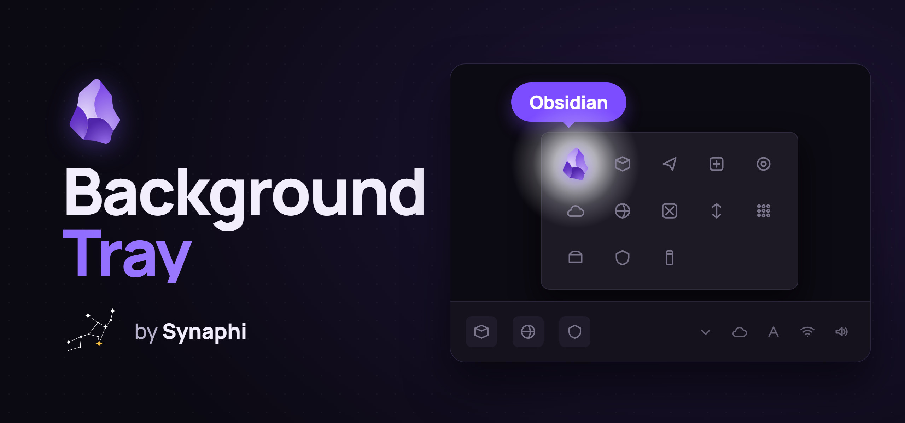

# Background Tray

Keep Obsidian running in the system tray instead of quitting when you close the window.

**One job, done well.** Background Tray is intentionally tiny and single-purpose — close-to-tray and a tray icon, nothing else. No background services, no extra UI, no bloat. Turn it off and Obsidian behaves exactly as before.

A robust, modern reimplementation of the (now unmaintained) `obsidian-tray`, built for Obsidian / Electron in 2026.

> Desktop only. Windows and macOS are fully supported. Linux tray behaviour depends on your desktop environment and is best-effort.

## Why keep Obsidian in the tray?

- **Sync keeps working in the background.** Because Obsidian stays running when you close the window, Obsidian Sync (and any other background sync) keeps going on its own instead of pausing until you reopen the app. Close the window, walk away — your vault stays up to date.
- **Instant reopen.** Bringing Obsidian back from the tray is immediate — no cold start, no vault picker.
- **Lightweight.** It just keeps the window alive in the tray; it adds no measurable overhead.

## Features

- **Run in background** — closing the window (X) hides Obsidian to the tray instead of quitting.
- **Tray icon** — left-click toggles show/hide; right-click menu is headed by the vault name, then Show/Hide, Relaunch, Quit completely. Uses Obsidian's own app icon by default.
- **Single-instance focus** — relaunching Obsidian while it's hidden in the tray restores the existing window instead of opening the vault switcher. (Toggle in settings.)
- **Quit completely / Relaunch** — from the tray icon's right-click menu.
- **Tells your vaults apart** — with several vaults open you get one tray icon each; the tooltip and the right-click menu header both show that icon's vault name.
- **Custom tray icon & tooltip** — `{{vault}}` is replaced with the vault name.
- Turning the plugin off restores all default behaviour completely (no leftover listeners).

## Install

**Community store:** Settings → Community plugins → Browse → search **Background Tray** → Install → Enable.

**Manual:** copy `main.js`, `manifest.json`, and `styles.css` into
`<vault>/.obsidian/plugins/background-tray/`, then enable it under
Settings → Community plugins.

**BRAT (beta):** add this repo in the BRAT plugin.

## Usage

Close the window and Obsidian keeps running in the tray — and so does your sync. Click the tray icon to bring it back. To actually quit, right-click the tray icon and choose **Quit completely**.

## What's new in 1.09.14

- **Fix (#3 follow-up): pop-out windows and the Settings window now hide and come back together with the main window.** Closing the main window (X) used to make Obsidian's own quit hook close every secondary window — a tab moved to a new window, or the Settings window — so nothing but the main window came back from the tray. Hiding from the tray icon left them on screen instead. Now the whole vault goes to the tray and the whole vault comes back.
- **Fix (#3 follow-up): Relaunch Obsidian no longer opens the vault picker instead of your vault.** If Obsidian had been reopened from the taskbar while hidden (which leaves a hidden vault-picker window behind), a Relaunch from the tray menu made Obsidian mark the vault as closed on the way out. The same happened with several vaults open (only the last one came back). Both cases are handled.

## What's new in 1.09.13

- **Fix (#3):** after reopening Obsidian from the taskbar while it was hidden in the tray, **Quit completely** could leave a headless Obsidian process behind — no window, no tray icon, only Task Manager could end it. Cause: the vault picker that Obsidian opens on relaunch was kept hidden but never closed, so Obsidian never reached its "all windows closed" exit. The hidden picker is now removed whenever the window really goes away (Quit completely, closing with *Run in background* off, disabling the plugin, or turning the option off). Side effect fixed too: after such a relaunch the vault was being marked "closed" on quit, so the next launch showed the vault picker instead of your vault.
- **Versioning:** from this release the version is the date — `<year>.<MM>.<DD>`, e.g. `1.09.13` = 2026-09-13 (the first number counts years since 2026). A second release on the same day gets a fourth number (`1.09.13.2`).

## What's new in 1.0.9

- The settings screen is now in English. The option descriptions, notices and error messages had been Korean since 1.0.1 — only the option names were translated.

## What's new in 1.0.8

- **Fix:** with several vaults open, every tray icon showed the same tooltip. Each icon now shows its own vault name.
- The tray icon's right-click menu is headed by the vault name, so you can tell the icons apart without hovering.
- Default tray tooltip is now `{{vault}} — Obsidian`.
- Command-palette entries are back (**Show window**, **Hide window**, **Show / Hide window**) for hotkey binding — thanks to [@theruansilva](https://github.com/theruansilva) ([#2](https://github.com/Synaphi/background-tray/pull/2)).

## What's new in 1.0.7

- **Fix:** relaunching Obsidian from the taskbar while it is hidden in the tray now restores the existing window without closing the transient vault switcher. The switcher is hidden and removed from the taskbar instead, avoiding Electron's `window-all-closed` quit path.

## What's new in 1.0.6

- **Fix:** relaunching Obsidian from the taskbar while it was hidden in the tray could quit the running instance. The vault switcher is now suppressed safely without ever tearing down the existing window.
- Removed the command-palette entries to keep the plugin strictly single-purpose (everything is on the tray icon's right-click menu).

## What's new in 1.0.5

- Reopening Obsidian from the taskbar while it's hidden in the tray no longer flickers (the vault switcher is suppressed before it ever appears).
- Cleaner default tray tooltip (`{{vault}} - Background Tray`).
- Documented that keeping Obsidian in the tray lets Obsidian Sync keep running in the background.

## Building

```bash
npm install
npm run dev     # watch build → main.js
npm run build   # typecheck + production bundle
```

## License

MIT © Synaphi
